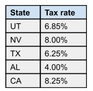
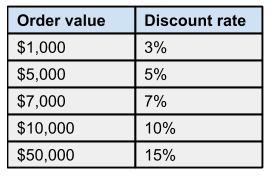

# elephant-carpaccio

see 
https://docs.google.com/document/d/1TCuuu-8Mm14oxsOnlk8DqfZAA1cvtYu9WGv67Yj_sSk/pub

to run:
 - maven compile
 - java -jar elephant-carpaccio-java-1.0-SNAPSHOT.jar itemNumber price state

rules:
 - tell don't ask principle
 - avoid primitive type

State Allowed:

Discount applied:

